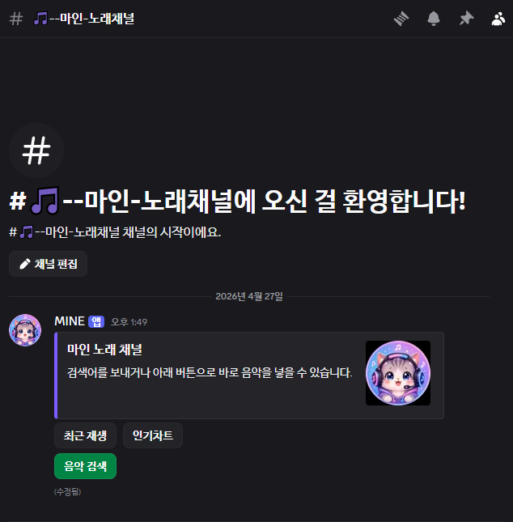
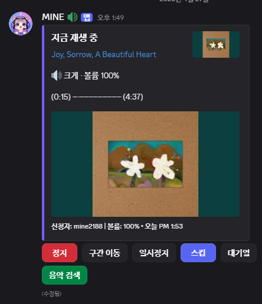

# 마인 Discord 봇

제 개인 서버에서 쓰기 좋게 다듬은 Discord 음악 봇입니다. **전용 노래 채널(Soundroom)** 중심으로 재생하고, 플레이리스트·인기차트·슬래시 몇 개만 유지한 가벼운 구성입니다.

## 스크린샷

노래 채널 패널:



지금 재생 중 패널:



## 기능

- **노래 채널(Soundroom)**: `/세팅`으로 전용 텍스트 채널·패널 생성 후, **채팅 검색어·패널 버튼·대기열 패널·(일반 채널의) 플레이어 버튼**으로 재생·대기열·일시정지 등 조작 (레포에는 `/play`·24/7·가사·Top.gg 투표 같은 **옛 일반 음악봇 루트는 제거**됨)
- 플레이리스트: **`/playlist`**(한국어 표기: **`/플레이리스트`**) 한 개만 등록 — 서브로 `create` / `add` / `load` / `view` / `remove` / `delete`
- 인기차트: **전역** 유튜브 재생목록 하나 — `.env`의 `DISCORD_OWNER_IDS`에 넣은 **제작자만** `/melon_chart`(또는 `/인기차트-관리`)로 등록·해제. 등록해 두면 **모든 서버** 노래 채널 **[인기차트]** 버튼이 같은 목록을 재생
- SQLite 저장소: 서버 설정, 최근 재생, 플레이리스트 저장 (런타임 DB는 레포 루트 **`/storage/`**·`*.sqlite`는 `.gitignore` — **예전에 DB를 커밋했다면** `git rm --cached -r --ignore-unmatch storage/*.sqlite` 후 한 번 정리)

## 준비

1. Node.js 20 이상을 설치합니다.
2. Lavalink 서버를 준비합니다.
3. `.env.example`을 복사해서 `.env`를 만들고 값을 채웁니다.

```bash
npm install
npm run start:bot
```

(`start:bot` / `start`는 실행 전에 자동으로 `build`를 돌립니다. `dist`만 갱신하고 싶으면 `npm run build`만 쓰면 됩니다.)

**패키지 매니저:** 기본은 **npm** (`package-lock.json`). Bun으로 돌릴 수도 있어 **`bun.lock`도 같이 두었습니다** — 둘 중 하나만 써도 되고, 둘 다 최신으로 맞추려면 `npm install` 후 `bun install`을 각각 실행하면 됩니다.

Bun 예시:

```bash
bun install
bun run start:bot:bun
```

**`DEV_GUILD_ID`:** 쉼표로 여러 길드 ID를 넣을 수 있습니다. **해당 길드에는 슬래시가 즉시** 반영되고, 봇은 **글로벌 슬래시도 항상 같은 목록으로 덮어씁니다**(다른 서버 반영까지 최대 약 1시간). 여전히 특정 서버에만 `/`가 안 뜨면 봇 초대 URL에 **`scope=bot%20applications.commands`**(슬래시 권한)가 포함됐는지 확인하세요.
